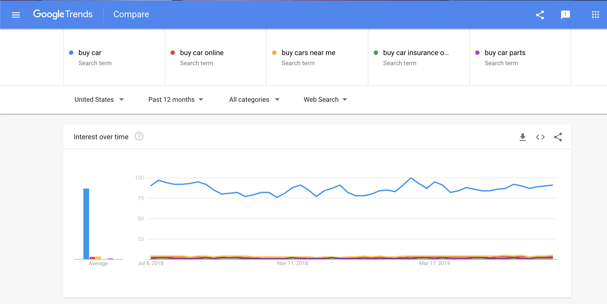

KeyWord-Recommender
=====

Uses User Keyword and Google Autocomplete to show Google Trends Results. Useful for People to Imrove their SEO Rankings.

Description
-------

* Accepts input from user for a keyword eg. Bike
* Next, gets the region the user wants to focus on (Defualt is UNITED STATES).
* Opens a new tab in your default browser with your keyword and 4 additional recent suggestions (from Google Autosuggestions) in Google Trends for past 12 months.  

**SAMPLE INPUT**::

    Write your keyword: buy car
    Type Full Country Name in CAPITAL LETTERS [Default is UNITED STATES]: UNITED STATES

**SAMPLE OUTPUT**
|TrendExample|

Data source: `Google Trends`_

.. _Google Trends: https://trends.google.com/trends/explore?geo=US&q=buy%20car,buy%20car%20online,buy%20cars%20near%20me,buy%20car%20insurance%20online,buy%20car%20parts

